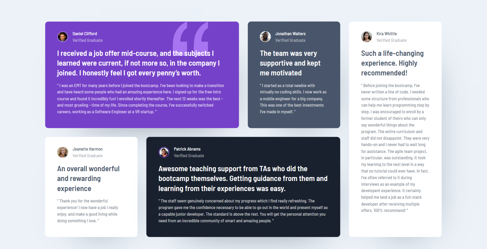

# Frontend Mentor - Testimonials grid section solution

This is a solution to the [Testimonials grid section challenge on Frontend Mentor](https://www.frontendmentor.io/challenges/testimonials-grid-section-Nnw6J7Un7). Frontend Mentor challenges help you improve your coding skills by building realistic projects.

## Table of contents

-   [Overview](#overview)
    -   [The challenge](#the-challenge)
    -   [Screenshot](#screenshot)
    -   [Links](#links)
-   [My process](#my-process)
    -   [Built with](#built-with)
    -   [What I learned](#what-i-learned)
    -   [Continued development](#continued-development)
    -   [Useful resources](#useful-resources)
-   [Author](#author)

## Overview

### The challenge

Users should be able to:

-   View the optimal layout for the site depending on their device's screen size

### Screenshot



### Links

-   Solution URL: [Github](https://github.com/bramuccci/frontend-mentor-testimonial-section)
-   Live Site URL: [Netlify](https://bramuccci-testimonial-section.netlify.app/)

## My process

### Built with

-   Semantic HTML5 markup
-   Modular Sass

### What I learned

I learned the use of mixins for modifiers.

```Scss
@mixin card-colors($background: $white, $text-color: $grayish-blue) {
    background-color: $background;
    color: $text-color;

    p span {
        color: rgba($text-color, $alpha: 0.5);
    }

    > p {
        color: rgba($text-color, $alpha: 0.7);
    }
}
```

### Continued development

I want to improve my archive architecture.

### Useful resources

-   [How does CSS nth-child() really work?
    ](https://www.youtube.com/watch?v=KIIktcWu6hc) - This short video helped me to understand quicly how :nth-child() works.

## Author

-   Frontend Mentor - [@liltanie](https://www.frontendmentor.io/profile/liltanie)
-   Twitter - [@bramuccci](https://www.twitter.com/bramuccci)
